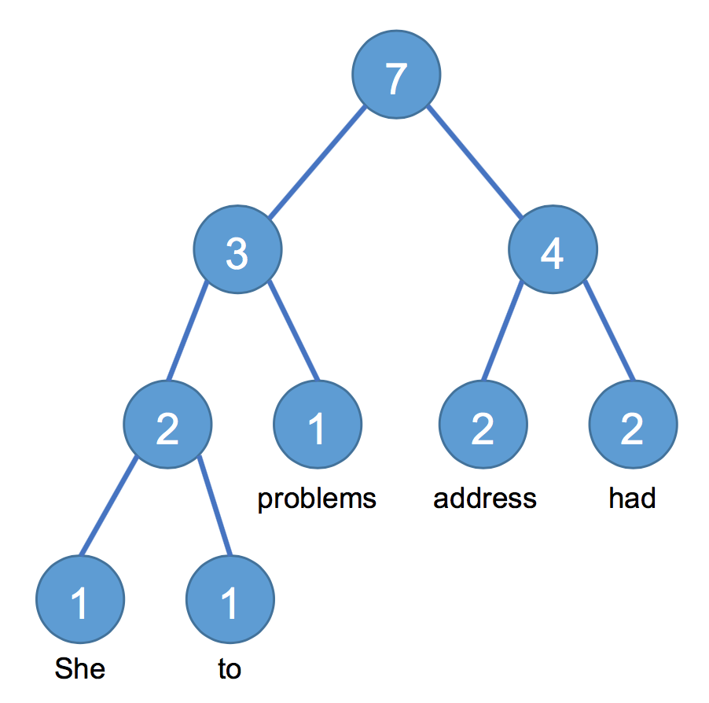

## Word Counter Binary Tree - Problem Description

Write a Java-based program (command line) that reads text from a file, splits it into words at spaces and newline characters and constructs an (unbalanced) binary tree where each leaf node represents a unique word.

The tree construction shall start by creating a node for each unique word, where a node has a field to keep track of the occurrence count. The algorithm starts with the two least occurring nodes and creates a parent node. The parent node gets assigned an occurrence count that is the sum of the word occurrences. The process then repeats, i.e., it locates the two nodes with the least occurrence count, creates a parent node, and so on, until all nodes are part of the tree.

Finally, print the tree to the console (very basic output is sufficient).

For example, the text “She had had to address address problems” results in this tree (note that there are multiple variants):



## Solution

The application receives a filename as a parameter. It is then parsed to get the words and number of occurrences stored in a map which is used to build the tree. Optionally, elements to be ignored can be passed as parameters, e.g. `( ) . ,`

By default it is not case sensitive, but it is possible to call the WordSplitter ignoreCase method and set it to false.

Execution: <br>
`WordCounterBinaryTree  filename [elements to be ignored]`

Sample execution and output 1:

```
$ WordCounterBinaryTree  resources/test01.txt  

7
├──4
│  ├──1  [ address ]
│  └––3
│     ├──1  [ (had) ]
│     └––2
│        ├──1  [ she ]
│        └––1  [ had, ]
└––3
   ├──1  [ (address); ]
   └––2
      ├──1  [ problems... ]
      └––1  [ to ]
```


Sample execution and output 2:

```
$ WordCounterBinaryTree  resources/test01.txt ( ) . , ; 

7 
├──3 
│  ├──1  [ problems ] 
│  └––2 
│     ├──1  [ to ] 
│     └––1  [ she ] 
└––4 
   ├──2  [ address ] 
   └––2  [ had ] 
```
